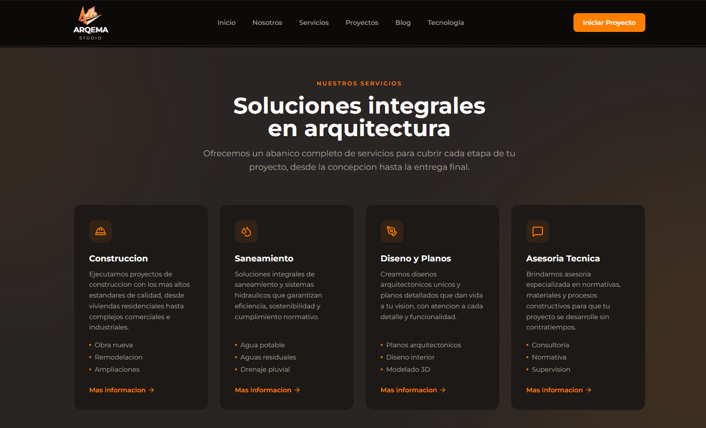
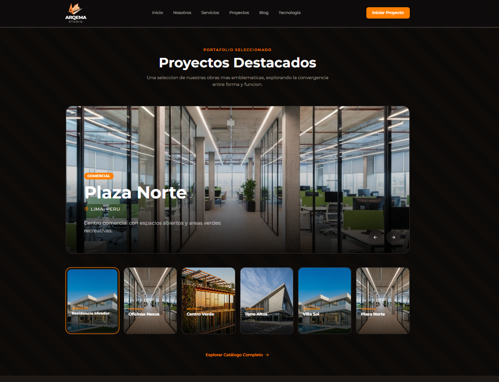
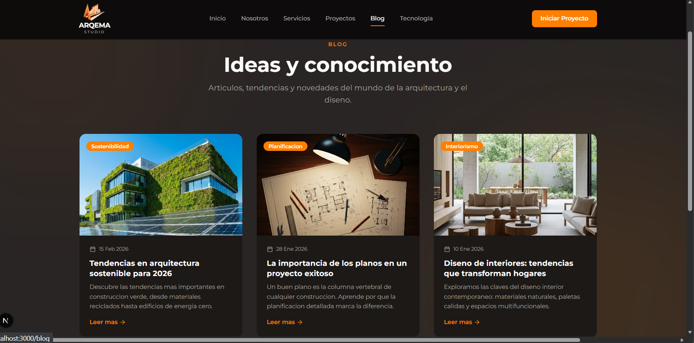
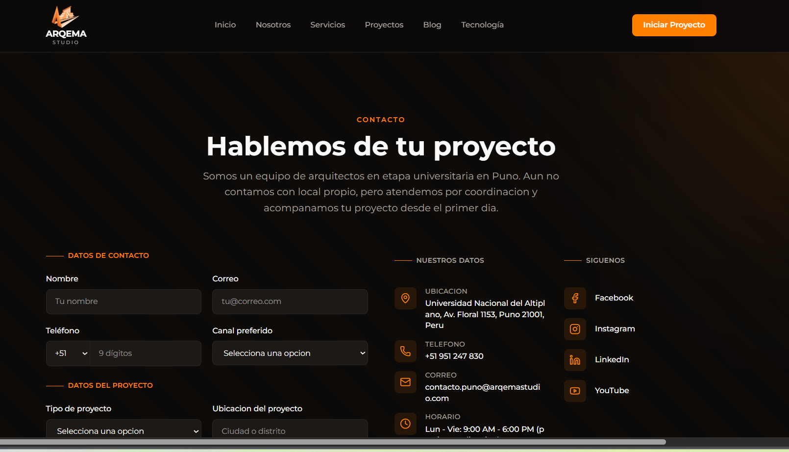

# ARQMA - Plataforma de Portafolio Arquitectónico

Sitio web profesional y panel administrativo para presentar proyectos arquitectónicos. Desarrollado con tecnologías modernas y enfoque en UX/UI.


---

## 🎯 Lo que hace

- **Sitio público completo**: Landing, blog, portafolio, contacto
- **Panel administrativo**: Gestión de contenido sin necesidad de código
- **Base de datos**: Integración con Supabase (en configuración)
- **Autenticación segura**: Login para administradores

---

## 📸 Páginas del Sitio

| Página | Descripción |
|--------|-------------|
| **Hero** | Landing page con presentación principal |
| **Servicios** | Catálogo de servicios ofrecidos |
| **Proyectos** | Portafolio con galería de proyectos |
| **Blog** | Artículos y contenido de interés |
| **Contacto** | Formulario para consultas |
| **Nosotros** | Información sobre el equipo |

---

## 🛠️ Stack Tecnológico

```
Frontend:
  • Next.js 14 (App Router)
  • TypeScript
  • Tailwind CSS
  • Shadcn/ui (componentes)
  • React Hook Form

Admin:
  • Autenticación JWT
  • API REST custom
  • CRUD dinámico

Base de datos: (En configuración)
  • Supabase PostgreSQL
  • Row Level Security
  • Storage para imágenes
```

---

## 🚀 Instalación Rápida

```bash
# 1. Clonar
git clone https://github.com/tu-usuario/ARQMA.git
cd ARQMA

# 2. Instalar dependencias
npm install

# 3. Variables de entorno
# Crear .env.local con credenciales de Supabase (opcional)

# 4. Ejecutar
npm run dev

# 5. Abrir
# http://localhost:3000 → Sitio público
# http://localhost:3000/admin → Panel admin
```

---

## 📝 Panel Administrativo

Acceso a `/admin/login` para gesionar:

- ✏️ **Blog**: Crear, editar, eliminar artículos
- 📸 **Proyectos**: Administrar portafolio con imágenes
- 📊 **Dashboard**: Resumen de contenido
- 🔐 **Seguridad**: Autenticación y permisos

---

## 🎨 Características Visuales

- **Diseño responsivo**: Funciona en mobile, tablet, desktop
- **Tema oscuro/claro**: Con ThemeProvider personalizado
- **Componentes accesibles**: Basados en Shadcn/ui
- **Animaciones suaves**: Transiciones elegantes
- **Iconografía**: Lucide React icons

---

## 📋 Estado del Proyecto

### ✅ Completado
- [x] Frontend público (6 páginas)
- [x] Diseño responsivo
- [x] Panel administrativo
- [x] Autenticación
- [x] Componentes reusables

### ⏳ En Desarrollo
- [ ] Base de datos (Supabase config)
- [ ] API REST endpoints
- [ ] Subida de imágenes
- [ ] Email notifications

### 📅 Próximos Pasos
- [ ] Integración completa de BD
- [ ] Sistema de búsqueda
- [ ] Comentarios en blog
- [ ] Analytics

---

## 🔍 Estructura Simplificada

```
app/
├── admin/              # Panel administrativo
├── blog/              # Página de blog
├── proyectos/         # Página de proyectos
├── page.tsx           # Landing (hero, servicios, etc)
└── layout.tsx         # Layout global con tema

components/
├── ui/                # Componentes Shadcn/ui
├── navbar.tsx
├── footer.tsx
└── ...

lib/
└── utils.ts
```

---

## 🎓 Tecnologías Destacadas

### Next.js 14
- App Router moderno
- Server Components para optimización
- API Routes integradas
- Middleware para seguridad

### TypeScript
- Type safety en todo el código
- Interfaces bien definidas
- Mejor experiencia de desarrollo

### Tailwind CSS + Shadcn/ui
- Desarrollo ágil
- Componentes profesionales
- Fácil de personalizar

---

## 📸 Capturas del Proyecto

**Landing Page**


**Página de Servicios**


**Portafolio de Proyectos**


**Página de Blog**


**Contacto**


**Página Nosotros**


---

## 💡 Decisiones de Diseño

**Por qué Next.js 14?**
- Rendimiento optimizado
- App Router moderno y flexible
- Built-in middleware para autenticación
- Excelente SEO

**Por qué Shadcn/ui?**
- Componentes accesibles
- Código abierto y personalizable
- Gran comunidad
- Funciona perfecto con Tailwind

**Por qué Supabase?**
- PostgreSQL poderoso
- Auth integrado
- Real-time capabilities
- Storage para archivos

---

## 🔐 Seguridad

- Autenticación con JWT tokens
- Middleware de protección en rutas admin
- Validación cliente y servidor
- Type safety con TypeScript

---

## 📚 Documentación

Para detalles técnicos más completos:
- [Documentación completa](./docs/FULL_README.md)
- [Database Schema](./docs/database.md)
- [API Endpoints](./docs/api.md)

---

## 🚀 Deploy

Recomendaciones:
- **Vercel**: Optimizado para Next.js
- **Netlify**: Alternativa confiable
- **Railway/Render**: Con Supabase backend

```bash
# Vercel (automático desde GitHub)
npm run build
```

---

## 📄 Licencia

MIT License - Libre para usar y modificar

---

## 📞 Contacto & Soporte

¿Preguntas o sugerencias?  
Abre un issue en GitHub o contáctame directamente.

---

**Última actualización**: Marzo 2026  
**Versión**: 0.1.0 (Frontend Completo)
